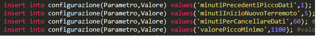
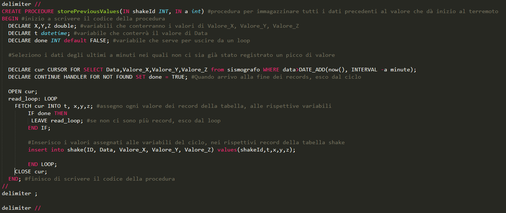

# Survey Station

## Implementazione

### Database
Una volta terminata la progettazione del database bisogna implementare/mettere in pratica ciò che si è fatto in maniera teorica. Come primissimo passo ho iniziato a scrivere il codice sql delle tabelle presenti sul database dato che senza di esse non è possibile lavorare. 
 

 
L'immagine qui sopra rappresenta il codice che ho ideato e scritto per la creazione delle tabelle "utenti" e "configurazione". La struttura delle linee è la classica di quando si crea una semplicissima tabella. Una piccola particolarità è l'attributo "unique" nel campo "email". Dato che quest'ultimo è la chiave primaria e che non ci saranno mai due indirizzi email uguali tra di loro, ho fatto in modo che queste restrizioni vengano rispettare tramite quell'attributo.
 
 

 
L'immagine appena inserita mostra il codice sql che ho scritto per la creazione delle tabelle "sismografo" e "shake". Potrebbe saltare subito all'occhio il fatto che non sono collegate tra di loro tramite delle foreign key. Ciò non è una dimenticanza o un errore di progettazione, ma semplicemente riflettendo sulla situazione che si è presentata, sono giunto alla conclusione che non fosse necessario relazionarle.
 
 
Nella tabella configurazione sono presenti dei campi i cui valori saranno usati successivamente nel trigger e nelle procedure. 
 

 
Sapendo che avrei avuto bisogno di campi che memorizzassero ogni quanto cancellare dei dati, dopo quanti minuti le scosse vengono catalogate come nuovi terremoti, che valore minime viene considerato come "scossa di terremoto" e quanti sono i minuti che precedono un picco, ho inserito questi dati nella tabella. Questa tabella si è resa necessaria poiché l'amministratore può modificare i dati a proprio piacimento e il codice agirà di conseguenza. Al contrario, egli avrebbe dovuto far passare ogni riga di codice e vedere dove fosse inserito uno di questi valore e lo avrebbe dovuto cambiare manualmente. Ciò è estremamente scomodo, dispersivo, fa perdere tempo e incremente tantissimo la possibilità di commettere un errore che andrebbe a compromettere il funzionamento del progetto.
 
 
Parole
 

