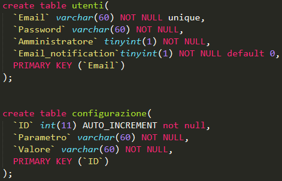
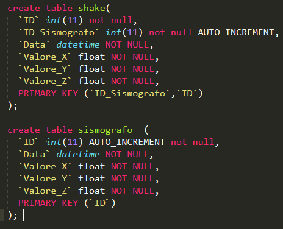
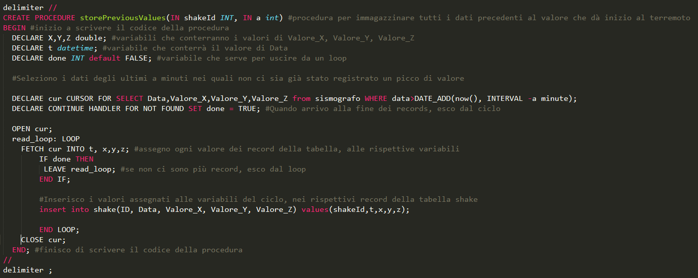
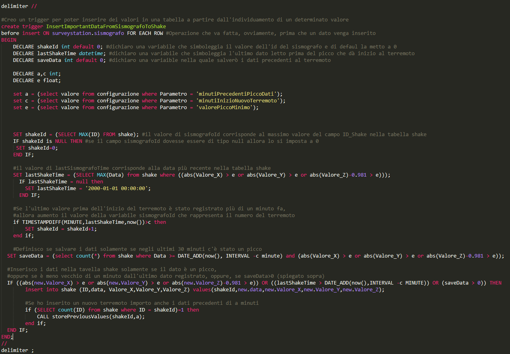

# Survey Station

## Implementazione

### Database
Una volta terminata la progettazione del database bisogna implementare/mettere in pratica ciò che si è fatto in maniera teorica. Come primissimo passo ho iniziato a scrivere il codice sql delle tabelle presenti sul database dato che senza di esse non è possibile lavorare. 
 

 
L'immagine qui sopra rappresenta il codice che ho ideato e scritto per la creazione delle tabelle "utenti" e "configurazione". La struttura delle linee è la classica di quando si crea una semplicissima tabella. Una piccola particolarità è l'attributo "unique" nel campo "email". Dato che quest'ultimo è la chiave primaria e che non ci saranno mai due indirizzi email uguali tra di loro, ho fatto in modo che queste restrizioni vengano rispettare tramite quell'attributo.
 
 

 
L'immagine appena inserita mostra il codice sql che ho scritto per la creazione delle tabelle "sismografo" e "shake". Potrebbe saltare subito all'occhio il fatto che non sono collegate tra di loro tramite delle foreign key. Ciò non è una dimenticanza o un errore di progettazione, ma semplicemente riflettendo sulla situazione che si è presentata, sono giunto alla conclusione che non fosse necessario relazionarle.
 
 
Nella tabella configurazione sono presenti dei campi i cui valori saranno usati successivamente nel trigger e nelle procedure. 
 

 
Sapendo che avrei avuto bisogno di campi che memorizzassero ogni quanto cancellare dei dati, dopo quanti minuti le scosse vengono catalogate come nuovi terremoti, che valore minime viene considerato come "scossa di terremoto" e quanti sono i minuti che precedono un picco, ho inserito questi dati nella tabella. Questa tabella si è resa necessaria poiché l'amministratore può modificare i dati a proprio piacimento e il codice agirà di conseguenza. Al contrario, egli avrebbe dovuto far passare ogni riga di codice e vedere dove fosse inserito uno di questi valore e lo avrebbe dovuto cambiare manualmente. Ciò è estremamente scomodo, dispersivo, fa perdere tempo e incremente tantissimo la possibilità di commettere un errore che andrebbe a compromettere il funzionamento del progetto.
 
 
Come ho già accennato precedentemente, per un fattore di analisi, a noi interessa poter immagazzinare i dati che precedono un terremoto. Ovviamente non ci interessano tutti, ma quelli che rientrano in un determinato range temporale (dettato da uno dei valori che ho inserito nalla tabella "configurazione"). Per questioni pratiche (date dal fatto che dovevo provare se il codice funzionasse) ho inserito il valore "1". In una situazione il numero di minuti sarà sicuramente maggiore. 
Per permettere di monitorare tutto ciò ho creato una procedura.
 

 
È possibile notare come la procedura necessiti di 2 parametri. Il primo "shakeId" rappresenta l'indenficativo di ogni terremoto, mentre il secondo (a) rappresenta il valore che indica il range temporale per salvare i dati. Se dovesse valere 2, significata che la procedura immagazinerebbe i dati partire da 2 minuti fa in avanti quando c'è un picco di dati. Una volta selezionati i dati a partire ad "a" minuti prima di un picco dalla tabella sismografo, essi vengono spostati nella tabella shake. Lo scopo di quest'ultima tabella è proprio quello di conservare tutti i dati considerati importanti dal punto di vista di analisi. Per ulteriori dettagli sul funzionamento di ogni singola riga di codice si possono leggere i commenti dato che sono esplicativi.
 
 
Parole
 

 
