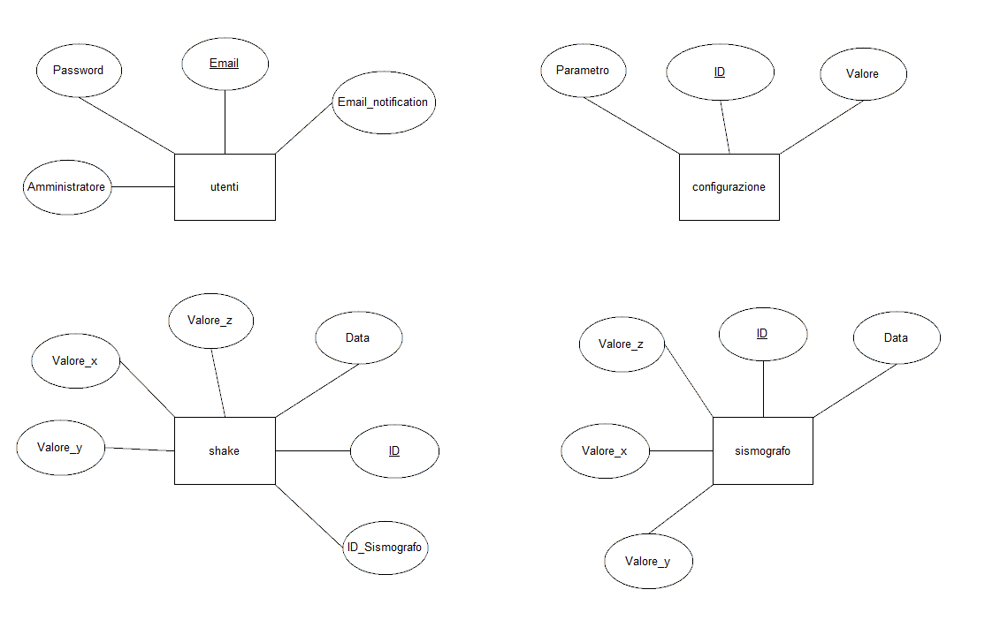

# Survey Station

### Design dei dati e database

La parte di design dei dati ha la funzione di mostrare che tipi di dati sono stati assegnati ai vari attributi delle tabelle presenti nel database. L'immagine che segue mostra il design dei dati del database "surveyStation", usato per questo progetto.

 
Nei campi "Amministratore" e "Email_Notification" ho usato il tipo di dato "tinyint" poiché è molto più conveniente che usare un altro tipo di flag. Si sarebbe potuto usare ad esempio un int e dire che se il campo equivale a 0 il valore è false, mentre se è 1 equivale a true. Sarebbe stata una soluzione che avrebbe portato allo stesso risultato, ma il tipo di dato int è indubbiamente più pesante rispetto al tinyint che assume solamente 2 valori. Per ottimizzare il database, le risorse e la memoria ho deciso di utilizzare questo tipo di dato. Nel nostro progetto la differenza potrebbe non sentirsi poiché le query non occupano tante linee di codice, ma in altri progetti l'ottimizzazione della memoria è cruciale ed è quindi meglio prevenire i disagi legati alle prestazioni.
 
Lo stesso discorso vale per la scelta effettuata sugli identificatori di ogni tabella. Ho utilizzato il tipo di dato int al posto di un dobule o di un float poiché le chiavi primarie sono sempre caratterizzate da numeri primi e quindi sarebbe stato inutile e dispendioso utilizzare dei tipi di dato che usano la virgola.
 
Nelle tabelle sismografo e shake, nei campi dove vanno inseriti i valori, ho preferito optare per un tipo di dato int piuttosto che altri poiché per la nostra analisi vanno benissimo i numeri senza virgola. Ciò comporta, come spiegato in precedenza, un miglioramente delle prestazioni e un risparmio di memoria.
 
 

### Schema E-R, schema logico e descrizione.

Lo schema E-R è fondamentale per la creazione di un database e quindi sono dovuto partire da qui per poi passare a scrivere il codice sql. Qui di seguito si può osservare come ho pensato di strutturare il database con le rispettive tabelle.

 
Per creare questo schema ho pensato a come questo progetto verrà utilizzato. Ovviamente diverse persone vi accederanno con il proprio account e ciò mi ha fatto subito pensare ad una tabella che gestisca gli utenti che usufruiscono del servizio da noi messo in piedi.
 
L'arduino, al quale è attaccato un sensore, si occupa di percepire le vibrazioni terrestre che avvengono e quindi i dati da esso registrati devono essere registrati da qualche parte. Da qui è nata la tabella sismografo. 
 
Ovviamente, e auspicabilmente, la maggior parte dei dati registrati dall'arduino ed inseriti nella tabella sismografo sono insignificanti poiché non permettono di osservare nulla. La parte "interessante", dal punto di vista d'analisi, si verifica quando vi è una scossa di ciò che secondo l'arduino è etichettabile come una scossa di terremoto. Ho creato la tabella Shake per poterci inserire i dati interessanti e in modo da facilitare il lavoro anche a coloro che si sono occupati della rappresentazione grafica dei dati in questione.
 
Salta subito all'occhio che le tabelle presenti nello schema non sono in nessun modo relazionate tra di loro. Non si tratta di un errore o di disattenzione, ma semplicemente per raggiungere il nostro obiettivo non c'era il bisogno di creare delle relazioni. 
 
Nella tabelle "utente" l'identificatore primario è il campo "email". Abbiamo optato per questa soluzione poiché due o più utenti non possono avere lo stesso indirizzo email e ciò fa risparmiare anche memoria, oltre che a rendere più ordinata e pulita la tabella e il codice che la riguarda.  
 
 
 
 
### Design dei dati e database
 
